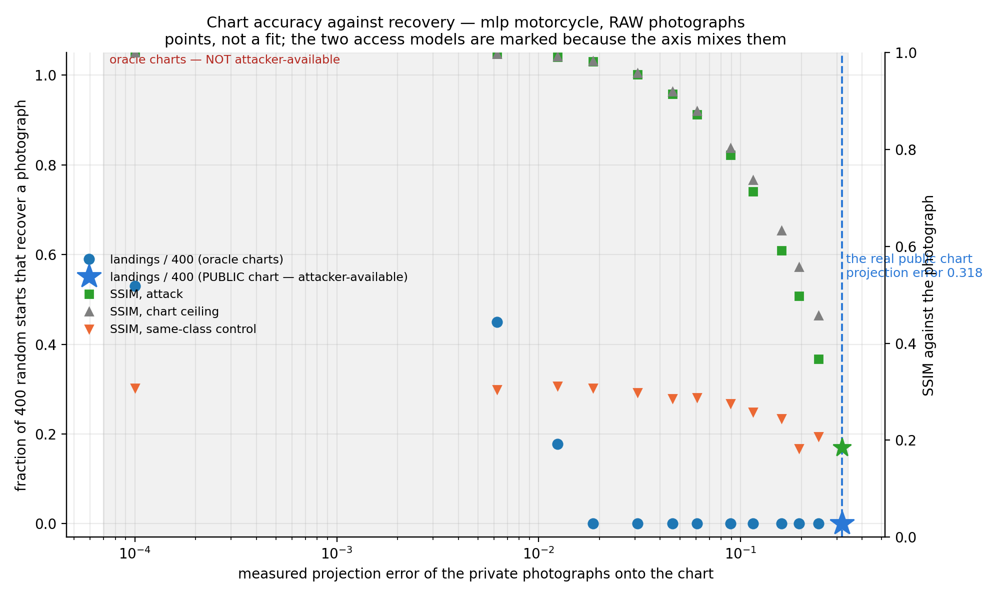
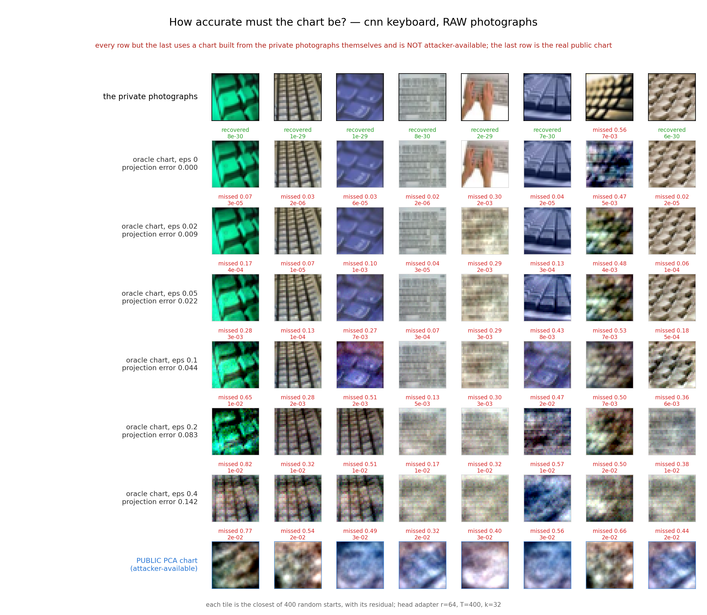
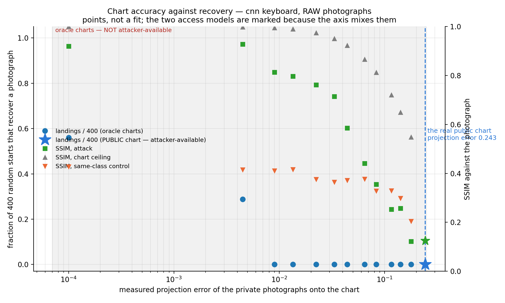
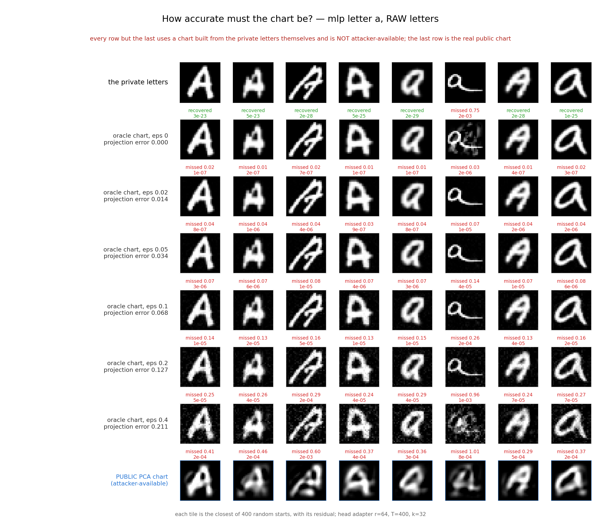
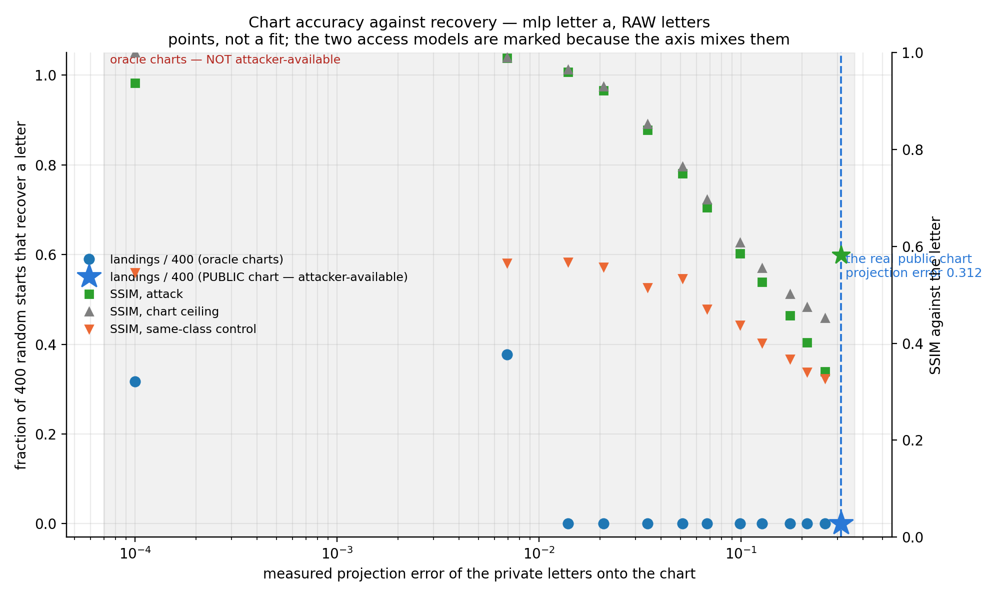
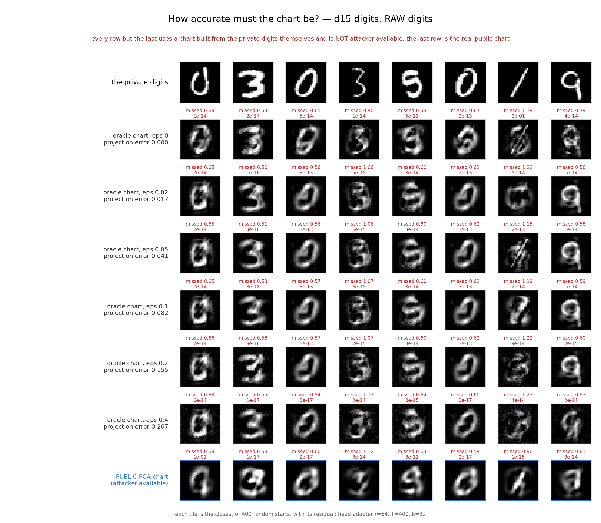
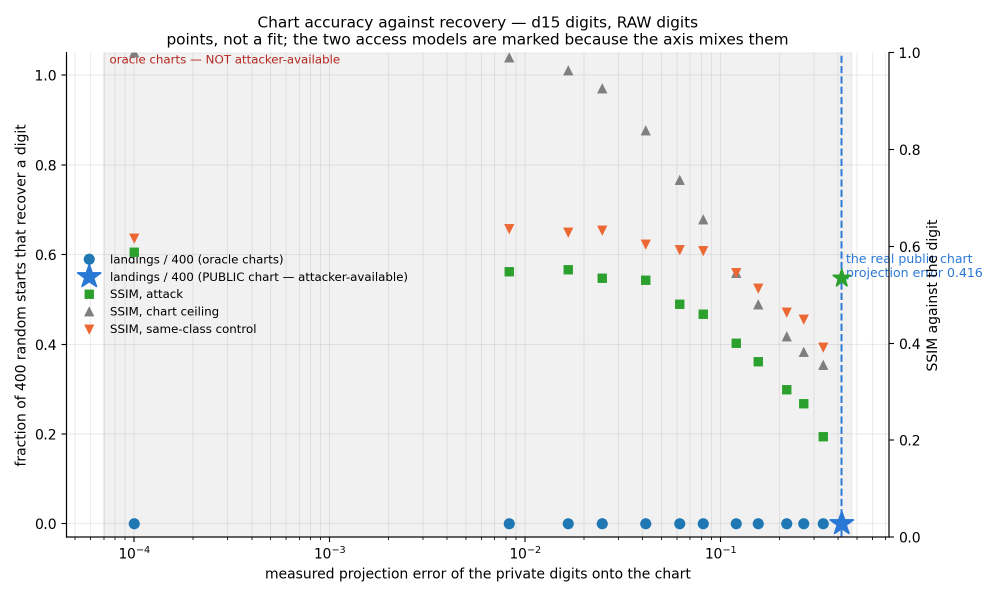

# How accurate must the chart be? The oracle ladder on the two meeting examples

Two examples, chosen so every figure in the talk is about the same objects: **eight CIFAR-100 motorcycles added to the CIFAR-10 MLP**, and **eight CIFAR-100 keyboards added to the CIFAR-10 CNN**. Head adapter r=64, T=400 SGD steps, k=32, 400 random starts, the same Levenberg-Marquardt solver and the same landing bar (relative image error below 1e-2) in every cell, with nothing tuned between cells.

**The privates are the RAW photographs**, not their chart projections: the adapter is fine-tuned on the photographs and the attack targets the photographs.

## Two things to read before the tables

**`eps` is not the chart's error.** The ladder perturbs each private photograph by relative noise `eps` and then spans the perturbed vectors, so the true photographs do not lie in the resulting chart. What belongs on the axis is the **measured relative projection error of the true photographs** onto each chart, reported beside `eps` in every row, and it is what both figures are drawn against. At `eps = 0` the chart spans the photographs exactly, so that error is **zero by construction** and that cell is effectively on-chart even though the privates are raw — it anchors the axis rather than being a result.

**Only one point on these axes is an attack.** Every oracle chart is built from the private photographs themselves and is **not attacker-available at any `eps`, including 0**; they measure a fidelity ceiling. The public PCA row is the only attacker-available cell, and it is marked on both figures rather than only in a caption. No median or total anywhere pools the two.

**The releases are new, and the private images are not.** These cells are fine-tuned on the raw photographs, while the existing motorcycle and keyboard cells elsewhere in this study are fine-tuned on chart projections. Same eight photographs, same seed, **different release** — the earlier one could not be reused because it was trained on projections. A slide may place a ladder panel beside an on-chart panel, but a reader must not read a difference between them as an effect of the chart alone.

**The two examples differ in backbone as well as class** (MLP against CNN), so if they disagree about where the gate sits, the disagreement is **not attributable to the class** and they are reported separately rather than averaged.

**These tables were regenerated after a bug in this generator, and the numbers moved.** The cell measurements (jobs in `results/oracle_ladder/rows.jsonl`, 28 cells, one job each) were never re-run and are unchanged; what was wrong was the prose the generator derived from them. It computed the first chart that *leaves* the SSIM ceiling and then printed it as the last chart that *tracks* it — off by one row on both examples — and, where no chart recovered all eight, it still placed the public chart '**below** the last error at which every photograph is recovered', a comparison against a threshold that does not exist on that example, in the direction that would suggest the public chart ought to work. Both are fixed and the no-threshold case now says so explicitly. Any earlier copy of this file carrying those two sentences should be discarded rather than reconciled.

## mlp motorcycle  (13 charts)

| chart | eps | measured projection error of the photographs (mean, range) | landings / 400 | images found | residual at the photographs (max) | median start residual | SSIM attack | SSIM ceiling | SSIM control | top-20 all landings |
|---|---|---|---|---|---|---|---|---|---|---|
| oracle (not attacker-available) | 0 | 0.0000  (0.0000–0.0000) | 212/400 | 8/8 | 2.8e-14 | 4.9e-28 | 1.00 | 1.00 | 0.31 | yes |
| oracle (not attacker-available) | 0.01 | 0.0062  (0.0039–0.0107) | 180/400 | 7/8 | 2.8e-14 | 1.2e-07 | 1.00 | 1.00 | 0.31 | yes |
| oracle (not attacker-available) | 0.02 | 0.0124  (0.0079–0.0214) | 71/400 | 3/8 | 2.8e-14 | 4.7e-07 | 0.99 | 0.99 | 0.31 | yes |
| oracle (not attacker-available) | 0.03 | 0.0186  (0.0118–0.0319) | 0/400 | 0/8 | 2.8e-14 | 1.1e-06 | 0.98 | 0.98 | 0.31 | no (0/20) |
| oracle (not attacker-available) | 0.05 | 0.0309  (0.0196–0.0529) | 0/400 | 0/8 | 2.8e-14 | 2.9e-06 | 0.96 | 0.96 | 0.30 | no (0/20) |
| oracle (not attacker-available) | 0.075 | 0.0460  (0.0293–0.0784) | 0/400 | 0/8 | 2.8e-14 | 6.5e-06 | 0.92 | 0.92 | 0.29 | no (0/20) |
| oracle (not attacker-available) | 0.1 | 0.0608  (0.0389–0.1030) | 0/400 | 0/8 | 2.8e-14 | 1.1e-05 | 0.87 | 0.88 | 0.29 | no (0/20) |
| oracle (not attacker-available) | 0.15 | 0.0891  (0.0574–0.1486) | 0/400 | 0/8 | 2.8e-14 | 5.2e-05 | 0.79 | 0.80 | 0.28 | no (0/20) |
| oracle (not attacker-available) | 0.2 | 0.1151  (0.0750–0.1888) | 0/400 | 0/8 | 2.7e-14 | 9.1e-05 | 0.71 | 0.74 | 0.26 | no (0/20) |
| oracle (not attacker-available) | 0.3 | 0.1598  (0.1067–0.2528) | 0/400 | 0/8 | 2.7e-14 | 2.0e-04 | 0.59 | 0.63 | 0.25 | no (0/20) |
| oracle (not attacker-available) | 0.4 | 0.1949  (0.1332–0.2981) | 0/400 | 0/8 | 2.8e-14 | 6.6e-04 | 0.50 | 0.56 | 0.18 | no (0/20) |
| oracle (not attacker-available) | 0.6 | 0.2428  (0.1717–0.3525) | 0/400 | 0/8 | 2.8e-14 | 7.8e-04 | 0.37 | 0.46 | 0.21 | no (0/20) |
| **public PCA (ATTACKER-AVAILABLE)** | — | 0.3176  (0.2241–0.4318) | 0/400 | 0/8 | 2.8e-14 | 2.3e-03 | 0.19 | 0.31 | 0.34 | no (0/20) |
| *wrong-release control, oracle eps 0* | 0 | 0.0000 | **0/400** | **0/8** | 6.4e-01 | 2.0e-03 | 0.17 | 1.00 | 0.28 | no |

- **Where exact landing stops.** All 8 photographs are still recovered at a measured projection error of 0.0000 and none at 0.0186.
- **Where the returned image leaves the ceiling.** The attack tracks the chart's own ceiling to within 0.05 SSIM up to a projection error of 0.1598, and falls below it at 0.1949 (0.50 against a ceiling of 0.56).
- **Where the real public chart sits.** Its projection error is 0.3176, above the last error at which every photograph is recovered (0.0000), and it returns 0 of 400 landings and 0 of 8 images.

## cnn keyboard  (13 charts)

| chart | eps | measured projection error of the photographs (mean, range) | landings / 400 | images found | residual at the photographs (max) | median start residual | SSIM attack | SSIM ceiling | SSIM control | top-20 all landings |
|---|---|---|---|---|---|---|---|---|---|---|
| oracle (not attacker-available) | 0 | 0.0000  (0.0000–0.0000) | 224/400 | 7/8 | 5.3e-15 | 1.2e-29 | 0.92 | 1.00 | 0.43 | yes |
| oracle (not attacker-available) | 0.01 | 0.0045  (0.0019–0.0088) | 115/400 | 1/8 | 5.3e-15 | 5.5e-06 | 0.93 | 1.00 | 0.41 | no (0/20) |
| oracle (not attacker-available) | 0.02 | 0.0090  (0.0037–0.0176) | 0/400 | 0/8 | 5.3e-15 | 3.0e-05 | 0.81 | 1.00 | 0.41 | no (0/20) |
| oracle (not attacker-available) | 0.03 | 0.0135  (0.0056–0.0263) | 0/400 | 0/8 | 5.3e-15 | 9.4e-05 | 0.80 | 0.99 | 0.42 | no (0/20) |
| oracle (not attacker-available) | 0.05 | 0.0224  (0.0093–0.0436) | 0/400 | 0/8 | 5.3e-15 | 4.1e-04 | 0.76 | 0.98 | 0.38 | no (0/20) |
| oracle (not attacker-available) | 0.075 | 0.0334  (0.0139–0.0646) | 0/400 | 0/8 | 5.3e-15 | 2.5e-03 | 0.71 | 0.95 | 0.36 | no (0/20) |
| oracle (not attacker-available) | 0.1 | 0.0441  (0.0183–0.0848) | 0/400 | 0/8 | 5.3e-15 | 2.9e-03 | 0.59 | 0.92 | 0.37 | no (0/20) |
| oracle (not attacker-available) | 0.15 | 0.0646  (0.0268–0.1218) | 0/400 | 0/8 | 5.3e-15 | 4.4e-03 | 0.44 | 0.87 | 0.38 | no (0/20) |
| oracle (not attacker-available) | 0.2 | 0.0834  (0.0346–0.1536) | 0/400 | 0/8 | 5.3e-15 | 7.0e-03 | 0.35 | 0.81 | 0.33 | no (0/20) |
| oracle (not attacker-available) | 0.3 | 0.1158  (0.0477–0.2022) | 0/400 | 0/8 | 5.0e-15 | 1.1e-02 | 0.25 | 0.72 | 0.33 | no (0/20) |
| oracle (not attacker-available) | 0.4 | 0.1417  (0.0576–0.2344) | 0/400 | 0/8 | 5.3e-15 | 1.4e-02 | 0.26 | 0.65 | 0.30 | no (0/20) |
| oracle (not attacker-available) | 0.6 | 0.1781  (0.0704–0.2698) | 0/400 | 0/8 | 5.3e-15 | 1.5e-02 | 0.12 | 0.55 | 0.20 | no (0/20) |
| **public PCA (ATTACKER-AVAILABLE)** | — | 0.2432  (0.0883–0.3788) | 0/400 | 0/8 | 5.3e-15 | 1.5e-02 | 0.13 | 0.31 | 0.29 | no (0/20) |
| *wrong-release control, oracle eps 0* | 0 | 0.0000 | **0/400** | **0/8** | 5.0e-01 | 6.8e-03 | 0.32 | 1.00 | 0.38 | no |

- **Where exact landing stops.** No oracle cell on this ladder recovered all 8; the most recovered anywhere is 7 of 8, at projection error 0.0000. This example therefore has no all-8 gate to locate, and none is quoted for it.
- **Where the returned image leaves the ceiling.** There is no tracking region on this example: the attack is already more than 0.05 SSIM below the chart's own ceiling at the lowest-error cell of the ladder (0.92 against 1.00 at projection error 0.0000), so the gap at that end is the search and not the chart.
- **Where the real public chart sits.** Its projection error is 0.2432. No oracle cell here recovered all 8, so there is no all-8 threshold to place it against, and above the largest error at which any start landed at all (0.0045). What is measured is that it returns 0 of 400 landings and 0 of 8 images.

## The two examples do not agree, and are not averaged

**The gate sits at a different place on each.** On the MLP/motorcycle release some start still lands at a measured projection error of 0.0124 and no start lands at 0.0186. On the CNN/keyboard release the last landing is at 0.0045 and none survives to 0.0090 — and even the exactly-spanning chart returns 7 of 8 rather than 8. The last-landing error differs by a factor of 2.8 between the two.

**What that difference cannot be attributed to.** The two cells differ in backbone (MLP against CNN) *and* in class (motorcycle against keyboard) at the same time, so this ladder cannot say which of the two moves the gate. It says only that the gate is not one number across releases. Nothing here is averaged over the two, and a single ladder figure should not be shown as though it were the ladder.

**Both pre-registered predictions held.** The attacker-available public PCA chart returns 0 of 400 on the motorcycle release and 0 of 400 on the keyboard release, at projection errors 0.3176 and 0.2432. The wrong-release control returns nothing even at an exactly spanning chart, which is what says the ladder is measuring the release and not the chart's ability to hold the images.

**`eps` is not proportional to the error it induces.** On the motorcycle ladder the measured projection error is 0.62 of `eps` at `eps`=0.01 and 0.40 of it at `eps`=0.6: the perturbation saturates, so `eps` must not be read as an error axis anywhere.

## mlp letter a  (13 charts) — MNIST, arm (a)

**Eight EMNIST letters `a` (test split) added as a NEW CLASS to the 3-layer MNIST MLP** (`models/exact_inversion/mnist_mlp_strong.pth`), the same eight letters as the existing letters cells (join-key indices into the letter-`a` test split: `[323, 693, 173, 92, 129, 696, 298, 767]`). Same construction as the CIFAR ladders: head adapter r=64, T=400, k=32, 400 random starts, the same solver and the same landing bar, privates RAW. The gate for the letters cells and for WP4's void condition.

**WP0 base-model record.** Train accuracy 99.83% (train loss 6.35e-03), test accuracy 98.21%, measured at load time on the full splits. The 'fully trained' gate of the plan is train >= 99.5% and train loss <= 1e-2: this checkpoint **passes** it.

| chart | eps | measured projection error of the letters (mean, range) | landings / 400 | images found | residual at the letters (max) | median start residual | SSIM attack | SSIM ceiling | SSIM control | top-20 all landings |
|---|---|---|---|---|---|---|---|---|---|---|
| oracle (not attacker-available) | 0 | 0.0000  (0.0000–0.0000) | 127/400 | 7/8 | 1.1e-11 | 9.2e-04 | 0.94 | 1.00 | 0.55 | yes |
| oracle (not attacker-available) | 0.01 | 0.0069  (0.0059–0.0116) | 151/400 | 7/8 | 1.1e-11 | 6.0e-04 | 0.99 | 0.99 | 0.57 | yes |
| oracle (not attacker-available) | 0.02 | 0.0139  (0.0117–0.0232) | 0/400 | 0/8 | 1.1e-11 | 6.0e-04 | 0.96 | 0.97 | 0.57 | no (0/20) |
| oracle (not attacker-available) | 0.03 | 0.0208  (0.0175–0.0348) | 0/400 | 0/8 | 1.1e-11 | 6.7e-04 | 0.92 | 0.93 | 0.56 | no (0/20) |
| oracle (not attacker-available) | 0.05 | 0.0345  (0.0290–0.0578) | 0/400 | 0/8 | 1.1e-11 | 7.5e-04 | 0.84 | 0.85 | 0.52 | no (0/20) |
| oracle (not attacker-available) | 0.075 | 0.0513  (0.0431–0.0863) | 0/400 | 0/8 | 1.1e-11 | 6.7e-04 | 0.75 | 0.77 | 0.53 | no (0/20) |
| oracle (not attacker-available) | 0.1 | 0.0677  (0.0568–0.1143) | 0/400 | 0/8 | 1.1e-11 | 7.4e-04 | 0.68 | 0.70 | 0.47 | no (0/20) |
| oracle (not attacker-available) | 0.15 | 0.0987  (0.0818–0.1684) | 0/400 | 0/8 | 1.1e-11 | 8.8e-04 | 0.59 | 0.61 | 0.44 | no (0/20) |
| oracle (not attacker-available) | 0.2 | 0.1271  (0.1029–0.2194) | 0/400 | 0/8 | 1.1e-11 | 9.1e-04 | 0.53 | 0.56 | 0.40 | no (0/20) |
| oracle (not attacker-available) | 0.3 | 0.1748  (0.1351–0.3102) | 0/400 | 0/8 | 1.1e-11 | 8.6e-04 | 0.46 | 0.50 | 0.37 | no (0/20) |
| oracle (not attacker-available) | 0.4 | 0.2114  (0.1567–0.3850) | 0/400 | 0/8 | 1.1e-11 | 9.4e-04 | 0.40 | 0.47 | 0.34 | no (0/20) |
| oracle (not attacker-available) | 0.6 | 0.2596  (0.1809–0.4923) | 0/400 | 0/8 | 1.1e-11 | 1.0e-03 | 0.34 | 0.45 | 0.33 | no (0/20) |
| **public PCA (ATTACKER-AVAILABLE)** | — | 0.3123  (0.1871–0.6906) | 0/400 | 0/8 | 1.1e-11 | 8.7e-04 | 0.58 | 0.69 | 0.56 | no (0/20) |
| *wrong-release control, oracle eps 0* | 0 | 0.0000 | **0/400** | **0/8** | 4.9e-01 | 7.0e-04 | 0.49 | 1.00 | 0.54 | no |

- **The gate, two ends.** No oracle cell recovered all 8 letters (the most anywhere is 7 of 8, at projection error 0.0000), so the all-8 end does not exist on this ladder; the smallest error at which none is found is 0.0139 (eps 0.02).
- **Where the returned image leaves the ceiling.** There is no tracking region on this example: the attack is already more than 0.05 SSIM below the chart's own ceiling at the lowest-error cell of the ladder (0.94 against 1.00 at projection error 0.0000), so the gap at that end is the search and not the chart.
- **Where the real public chart sits.** Its projection error is 0.3123 and above the zero end (0.0139); it returns 0 of 400 landings and 0 of 8 letters.
- **Wrong-release control.** The release trained on eight OTHER letters (indices `[328, 22, 408, 778, 565, 406, 499, 199]`) with the exactly-spanning chart of the true eight returns 0 of 400 landings and 0 of 8 letters (certificate residual at the true letters 4.9e-01).
- **Against the CIFAR ladders.** mlp motorcycle: all-8 end 0.0000, zero end 0.0186; cnn keyboard: all-8 end none, zero end 0.0090. This example differs from both in backbone (a 784-1000-1000 MNIST MLP) *and* in data (28x28 grey letters against 32x32 colour photographs), so a gate that sits elsewhere here is a difference between constructions, not a property of 'the gate'; the three are not averaged.

## d15 digits  (13 charts) — MNIST, arm (b)

**Eight MNIST TEST DIGITS with their TRUE labels on the 15-layer MNIST MLP of the depth window, head adapter only (the head is NOT extended: a confident batch of known classes)** (`models/exact_inversion/mnist_mlp_d15w1000.pth`), the same eight digits as the k-sweep (`real_encoder_ranklaw.py`) (join-key indices into the MNIST test split: `[723, 923, 2619, 3739, 5981, 4186, 6644, 913]`, labels `[0, 3, 0, 3, 5, 0, 1, 9]`). Same construction as the CIFAR ladders: head adapter r=64, T=400, k=32, 400 random starts, the same solver and the same landing bar, privates RAW. Shares encoder, images and chart pool (first 50 000 train digits) with the depth window; differs from it in adapter placement (head only) and in being a confident batch.

**WP0 base-model record.** Train accuracy 98.69% (train loss 4.92e-02), test accuracy 97.38%, measured at load time on the full splits. The 'fully trained' gate of the plan is train >= 99.5% and train loss <= 1e-2: this checkpoint **does NOT pass** it, and every row of this section is on that not-fully-trained base. d15 FAILED the WP0 base gate (98.69% train, CE 4.9e-2 at the time of the plan audit); used UNCHANGED because the depth window (real_encoder_ranklaw) was measured on it.

**Recording strength (eps 0 cell).** rank B_T = 8, ‖B_T‖_F = 3.737e-01, ‖B_T A_T‖_F = 4.089e-01, σ_N/σ_1 of B_T = 8.7e-11; per-image softmax residual at W0 [1.5e-02, 2.5e-08, 1.4e-05, 1.0e-03, 4.4e-01, 4.2e-07, 2.2e-06, 2.3e-08] and at T [7.6e-03, 3.6e-07, 3.0e-06, 3.2e-03, 4.8e-02, 5.7e-08, 2.0e-06, 3.4e-07] — a batch the base already classifies confidently leaves a weak recording, and the ladder must be read with that in view.

| chart | eps | measured projection error of the digits (mean, range) | landings / 400 | images found | residual at the digits (max) | median start residual | SSIM attack | SSIM ceiling | SSIM control | top-20 all landings |
|---|---|---|---|---|---|---|---|---|---|---|
| oracle (not attacker-available) | 0 | 0.0000  (0.0000–0.0000) | 0/400 | 0/8 | 7.9e-10 | 9.9e-13 | 0.59 | 1.00 | 0.62 | no (0/20) |
| oracle (not attacker-available) | 0.01 | 0.0083  (0.0067–0.0111) | 0/400 | 0/8 | 7.9e-10 | 7.8e-13 | 0.55 | 0.99 | 0.64 | no (0/20) |
| oracle (not attacker-available) | 0.02 | 0.0166  (0.0134–0.0222) | 0/400 | 0/8 | 7.9e-10 | 9.0e-13 | 0.55 | 0.96 | 0.63 | no (0/20) |
| oracle (not attacker-available) | 0.03 | 0.0248  (0.0202–0.0333) | 0/400 | 0/8 | 7.9e-10 | 1.2e-12 | 0.53 | 0.93 | 0.63 | no (0/20) |
| oracle (not attacker-available) | 0.05 | 0.0413  (0.0336–0.0554) | 0/400 | 0/8 | 7.9e-10 | 9.3e-13 | 0.53 | 0.84 | 0.60 | no (0/20) |
| oracle (not attacker-available) | 0.075 | 0.0616  (0.0503–0.0827) | 0/400 | 0/8 | 7.9e-10 | 1.0e-12 | 0.48 | 0.74 | 0.59 | no (0/20) |
| oracle (not attacker-available) | 0.1 | 0.0815  (0.0667–0.1095) | 0/400 | 0/8 | 7.9e-10 | 7.8e-13 | 0.46 | 0.66 | 0.59 | no (0/20) |
| oracle (not attacker-available) | 0.15 | 0.1198  (0.0981–0.1612) | 0/400 | 0/8 | 7.9e-10 | 7.9e-13 | 0.40 | 0.54 | 0.55 | no (0/20) |
| oracle (not attacker-available) | 0.2 | 0.1554  (0.1272–0.2097) | 0/400 | 0/8 | 7.9e-10 | 8.2e-13 | 0.36 | 0.48 | 0.51 | no (0/20) |
| oracle (not attacker-available) | 0.3 | 0.2173  (0.1764–0.2951) | 0/400 | 0/8 | 7.9e-10 | 1.2e-12 | 0.30 | 0.41 | 0.47 | no (0/20) |
| oracle (not attacker-available) | 0.4 | 0.2666  (0.2136–0.3645) | 0/400 | 0/8 | 7.9e-10 | 7.7e-13 | 0.28 | 0.38 | 0.45 | no (0/20) |
| oracle (not attacker-available) | 0.6 | 0.3346  (0.2602–0.4621) | 0/400 | 0/8 | 7.9e-10 | 9.9e-13 | 0.21 | 0.36 | 0.39 | no (0/20) |
| **public PCA (ATTACKER-AVAILABLE)** | — | 0.4165  (0.3031–0.6088) | 0/400 | 0/8 | 7.9e-10 | 4.2e-13 | 0.53 | 0.68 | 0.62 | no (0/20) |
| *wrong-release control, oracle eps 0* | 0 | 0.0000 | **0/400** | **0/8** | 9.8e-01 | 2.5e-14 | 0.57 | 1.00 | 0.57 | no |

- **The gate, two ends.** No oracle cell recovered all 8 digits (the most anywhere is 0 of 8, at projection error 0.0000), so the all-8 end does not exist on this ladder; the smallest error at which none is found is 0.0000 (eps 0).
- **Where the returned image leaves the ceiling.** There is no tracking region on this example: the attack is already more than 0.05 SSIM below the chart's own ceiling at the lowest-error cell of the ladder (0.59 against 1.00 at projection error 0.0000), so the gap at that end is the search and not the chart.
- **Where the real public chart sits.** Its projection error is 0.4165 and above the zero end (0.0000); it returns 0 of 400 landings and 0 of 8 digits.
- **Wrong-release control.** The release trained on eight OTHER digits (indices `[848, 6969, 6498, 7865, 789, 8078, 8651, 8494]`) with the exactly-spanning chart of the true eight returns 0 of 400 landings and 0 of 8 digits (certificate residual at the true digits 9.8e-01).
- **Against the CIFAR ladders.** mlp motorcycle: all-8 end 0.0000, zero end 0.0186; cnn keyboard: all-8 end none, zero end 0.0090. This example differs from both in backbone (the 15-layer, width-1000 MNIST MLP) *and* in data (28x28 grey digits against 32x32 colour photographs), so a gate that sits elsewhere here is a difference between constructions, not a property of 'the gate'; the three are not averaged.

